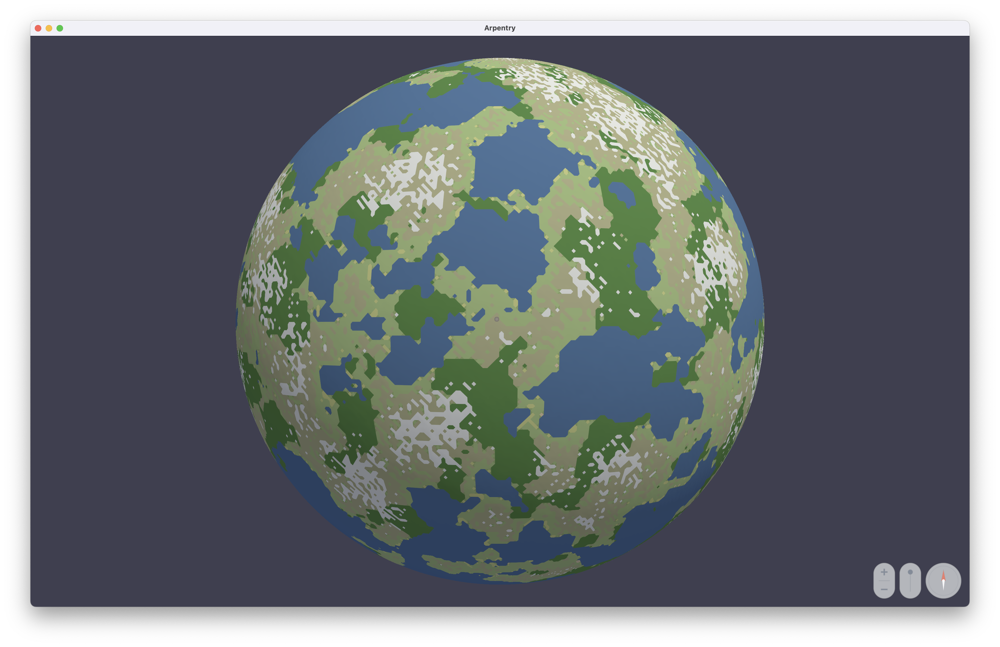
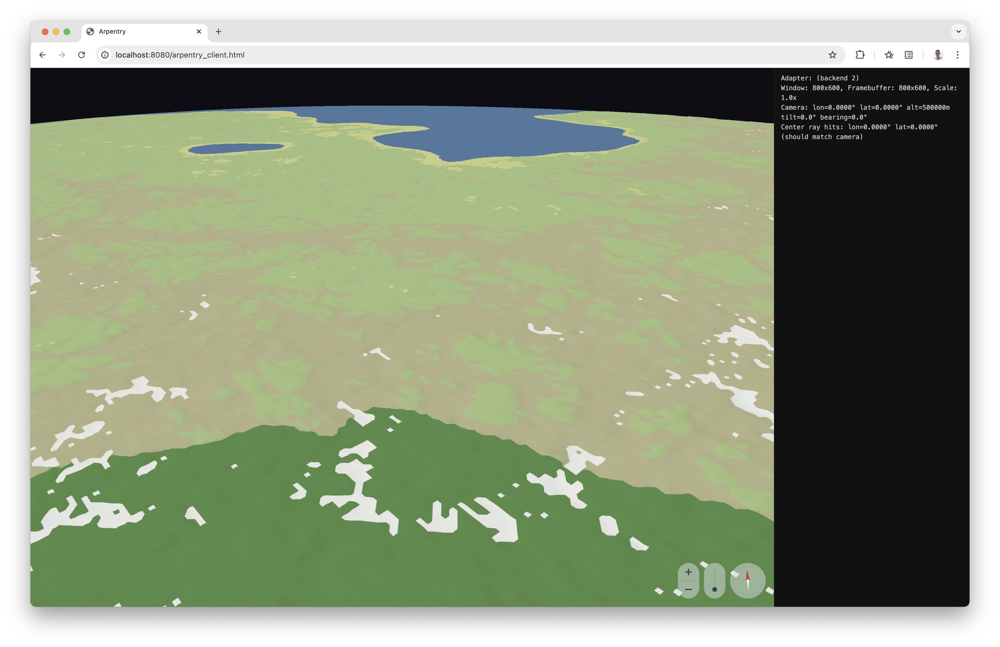

# Arpentry

An experimental stylized 3D globe map, written by Claude. The viewer is C; the
tiler that builds the world it draws is Rust.

- **Tile format** (`.arpt`) — Compact binary tiles using FlatBuffers (zero-copy) and Brotli (compression). Carries geometry and properties for client-side styling; meshes can embed lightweight materials. Tiles are shipped in a single `.arpa` archive.
- **Tiler** (`arpentry_tiler`) — Builds archives from GeoParquet sources (Overture, Natural Earth) and DEM tiles. Tile generation is framed as a sort problem: clip, sort by a space-filling-curve key, group, encode, write.
- **World model** — What makes the tiler more than a format converter: source data says a road is a bridge, not how high. A constraint solve derives the heights, an engineered ground is carved to meet them, and the paved surfaces are drawn as one fabric.
- **Tile server** (`arpentry_server`) — Serves an archive over HTTP, or synthesises tiles procedurally.
- **Tile viewer** (`arpentry_client`) — WebGPU 3D globe renderer. Native (macOS/Linux/Windows via GLFW) and WebAssembly (via Emscripten).

## Screenshots





## Building

The viewer and its shared library need CMake 3.20+ and a C11 compiler, with
every dependency fetched via FetchContent. The tiler, server and verifier are
one Rust crate under `server/`.

### Native

```bash
cmake -B build -DCMAKE_BUILD_TYPE=Debug
cmake --build build
ctest --test-dir build --output-on-failure
./scripts/run-native.sh
```

### Tiler, server and verifier

```bash
cd server
cargo build --release
cargo test
```

### Web (Emscripten)

Requires [Emscripten](https://emscripten.org/docs/getting_started/downloads.html).

The web build is a cross-compilation. FlatBuffers schemas must be compiled by a native host binary (`flatcc`), so `setup-web.sh` bootstraps a native build first, then configures the Emscripten build against it. This one-time setup only needs to be re-run after a `clean.sh`.

```bash
# One-time setup (configures build-native and build-web)
./scripts/setup-web.sh

# Build and run (rebuilds incrementally on each invocation)
./scripts/run-web.sh
```

## Project Structure

| Directory | Description |
|-----------|-------------|
| `common/` | Shared library: coordinate helpers, WGS84 math, tile encode/decode, hashmap, buffer utilities, 3D math |
| `client/` | WebGPU + GLFW viewer |
| `server/` | Rust crate: tiler, world model (solve, ground, surfaces), verification harness, tile server |
| `schemas/` | FlatBuffers schemas (compiled at build time) |
| `scripts/` | Build and run scripts |
| `docs/` | Format, viewer and world-model specifications (see below) |

## Documentation

| Document | What it owns |
|----------|-------------|
| `docs/MOTIVATION.md` | Project motivation and background |
| `docs/DESIGN.md` | Design principles: deep modules, pull complexity downward, define errors out of existence |
| `docs/STYLE.md` | C coding style guide |
| `docs/SOURCES.md` | The source data: what Overture carries, what the tiler reads, and the measured gap |
| `docs/FORMAT.md` | Tile format specification: geometry model, coordinate space, properties, FlatBuffers schema |
| `docs/TILER.md` | Tiler mechanics: the five stages, the sort key, the `.arpa` archive layout, the modules, the CLI |
| `docs/GENERATION.md` | The vertical world model: feature strata and authority, the constraint solve, the engineered ground, the invariants |
| `docs/GROUND.md` | The ground imprint and its per-zoom meshes |
| `docs/ROADS.md` | The horizontal road surface: widths, junction areas, markings |
| `docs/VIEWER.md` | Viewer specification: coordinate pipeline, tile management, rendering |
| `docs/CONTROL.md` | Map control specification: camera parameters, input bindings, pan/zoom/rotate, inertia, fly-to |

## AI Assistant

`CLAUDE.md` provides context for [Claude Code](https://claude.ai/code): conventions, gotchas, and pointers to the documentation above.

## Dependencies

Viewer and shared library (C, via CMake FetchContent):

- [FlatCC](https://github.com/dvidelabs/flatcc) — FlatBuffers compiler and runtime for C
- [Brotli](https://github.com/google/brotli) — compression
- [WebGPU-distribution](https://github.com/nicebyte/webgpu-distribution) — WebGPU headers and native backend
- [GLFW](https://www.glfw.org/) — windowing (native target)
- [glfw3webgpu](https://github.com/nicebyte/glfw3webgpu) — GLFW/WebGPU bridge
- [Unity](https://github.com/ThrowTheSwitch/Unity) — test framework

Tiler (Rust, via Cargo) — `server/Cargo.toml` says why each is there:

- [flatbuffers](https://crates.io/crates/flatbuffers) / [brotli](https://crates.io/crates/brotli) — the same tile format, from the other side
- [arrow](https://crates.io/crates/arrow) + [parquet](https://crates.io/crates/parquet) — GeoParquet input
- [i_overlay](https://crates.io/crates/i_overlay) — polygon buffer, union and offset for the road surface
- [spade](https://crates.io/crates/spade) — constrained Delaunay triangulation for the ground
- [earcutr](https://crates.io/crates/earcutr) — polygon-with-holes tessellation for building roofs
- [image](https://crates.io/crates/image) + [flate2](https://crates.io/crates/flate2) — Terrarium DEM tiles out of PMTiles archives
- [tiny_http](https://crates.io/crates/tiny_http) — the tile server's blocking HTTP/1.1 stack

## Acknowledgments

`common/`'s buffer and hashmap utilities derive from [pogocache](https://github.com/tidwall/pogocache) by Josh Baker, MIT license. They arrived with a C tile server that the Rust one has since replaced.
