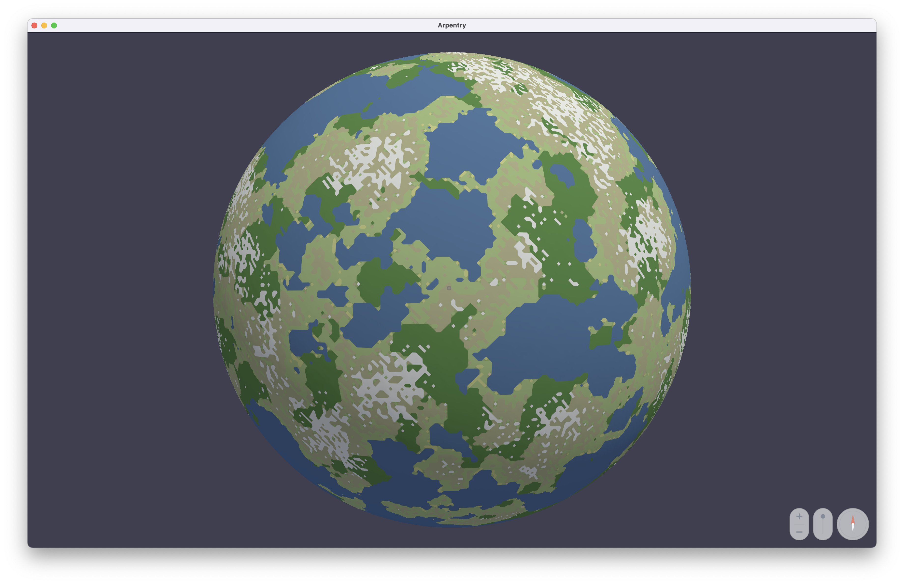
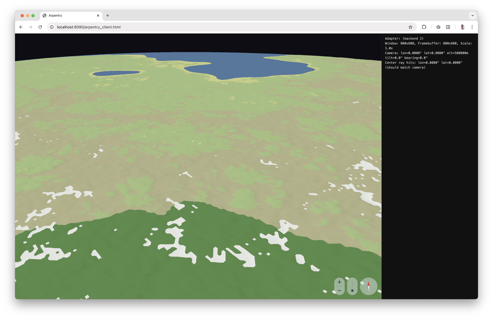

# Building a Globe Viewer When Software Is Cheap

*By Bertil Chapuis with Claude's help*

## A Map on the Wall

I grew up doing a bit of orienteering in the Gros de Vaud, the farmland north of Lausanne, Switzerland. Forests broken by fields, gentle hills with the Alps in the background. The sport hands you a map (Swisstopo, indeed) and a compass and drops you in the woods. You find the next control point or you don't. What mattered was reading the map and understanding the terrain.

At FOSS4G around 2007, I heard a keynote about neocartography: the idea that anyone with a browser could contribute to an interactive map felt electric. I then spent a few years contributing to map renderers and tile servers, and came to appreciate the tremendous effort (and funding) needed to build digital globes like Mapbox, MapLibre and Cesium. At FOSS4G 2022, with Maximilian (who did most of the heavy [work](https://github.com/maplibre/maplibre-rs)) and friends, we presented a [paper](https://isprs-archives.copernicus.org/articles/XLVIII-4-W1-2022/35/2022/isprs-archives-XLVIII-4-W1-2022-35-2022.pdf) on portable map renderers: write the rendering engine once, run it natively and in the browser. The idea landed. But the effort was still enormous even with a modern programming language such as Rust.

## Free Software as in Free Beer

By early 2026, the cost of producing code is dropping fast (the cost of knowing what to produce is not). Software (not necessarily free) may get free as in free beer. Large language models and AI agents can produce working code faster than a developer can type. The question changed from *can we write a portable globe viewer* to *if writing code costs almost nothing, how would we build a portable globe viewer?*

I wanted to find out. So I tried something on the side I would not have attempted last year: a globe viewer written in C, targeting WebGPU. Not because C is pleasant (I've only written a few lines of C professionally), but because C compiles everywhere (native, WebAssembly, embedded) with no runtime, no garbage collector, no surprises... right? WebGPU, thanks to wgpu.h, is the only modern GPU API that runs natively and in the browser through the same code path. I wrote the documentation before *writing* any code. And I tried to make every decision once: one tile format, one coordinate space, one compression codec, one geometry encoding per topology.

As programmers, we used to make different choices: a high-level language for productivity, an existing engine for rendering, a standard tile format to avoid reinvention. Those choices optimize for human writing speed. I wanted to see what happens when writing speed is no longer the constraint. What if you optimize for the output instead: binary size, portability, runtime cost, control?

After a few commits in terminal tab #6: a working globe with terrain, surfaces, roads, and extruded buildings. It almost feels presumptuous to say that I co-authored this code. For me, at least, the bottleneck moved. It is no longer the ability to write code. It is knowing *what* to build and *how*.

## Under the Hood

Earth is big. You cannot load it all. So the globe is divided into tiles, organized as a quadtree. Zoom in and tiles get smaller; the viewer loads only the ones the camera sees. Each vertex position is quantized to integers relative to tile bounds, wasting no bits on range.

Two design choices illustrate where the human decisions mattered.
- Many map and globe renderers decode tiles on the CPU before uploading to the GPU. For terrain, Arpentry skips that step. The raw quantized bytes go straight into GPU vertex buffers. The vertex shader handles dequantization, geodetic conversion, and projection in one pass. The CPU touches no terrain vertices.
- The camera never moves. It sits at the origin. The globe rotates and scales beneath it. The reason is float32 precision. A camera orbiting at 10,000 km from the Earth's center means every coordinate starts large. Fix the camera at the origin and nearby geometry has coordinates near zero, where float32 is densest.

## The Git Log

The git log tells more or less the story.

Commit 1: "Add Arpentry Tiles (.arpt) format specification." No code. A markdown file describing the tile format, coordinate space, quantization scheme, FlatBuffers schema, compression strategy. Documentation first. The hardest decisions come before the first line of code, and they should be written down.

Commit 2: "Add C/CMake monorepo with WebGPU hello-triangle client." A colored triangle on screen. Proof that the toolchain works.

Then the pieces arrive one by one. An HTTP server sourced from the excellent Pogocache. A common library, tile helpers and a tile server. The WebGPU globe renderer with camera and tile pipeline. Navigation with inertia and ray-cast pan. Raster data support. Surface textures. A UI overlay. Terrain noise rewrite. Towns with roads and extruded buildings. Each commit adds one capability. Most do not fix what the previous one broke. The log reads more like a build sequence than a debugging diary.

Nearly every commit carries a "Co-Authored-By: Claude" trailer. This is an accurate description of how the code was written. I described the design. The AI translated it into C. I considered Claude as the expert and turned off my second-guessing bias machine.

What the AI did well: turning documented specifications into working code. Given FORMAT.md, it produced a FlatBuffers schema and a complete encoder/decoder. Given the dequantization formula, it wrote the WGSL shader. Given a mathematical description of globe rotation (East-North-Up frame mapped to camera axes), it generated the matrix construction. It followed naming conventions across files, produced boilerplate without variation, and wrote test harnesses that exercised the code the way the documentation said it should work.

What the AI did not do, at least not yet, is decide the high-level architecture. The coordinate space, the fixed camera, the choice to push all vertex work to the GPU: these came from years of thinking about the problem. Maybe that will change. But in this project, the design decisions came from a person, and the code came from a collaboration.

The workflow was always the same. Write the document, then write the code. FORMAT.md before any tile code. VIEWER.md before the renderer. CONTROL.md before the input layer. DESIGN.md and STYLE.md before any substantive code. The documents are not afterthoughts or summaries. They are the design. The code is the implementation. When the spec was clear, the AI produced working code on the first pass. When the spec was vague, the code wandered and the fix followed.

## What Remains

High-level programming languages trade runtime overhead for human productivity. When writing code costs less, that trade-off shifts. The programmer's attention moves from *writing* code to *specifying* what the code should do.

What mattered in this project was broad yet fuzzy knowledge at two levels. At the top: domain knowledge (geodesy, numerical analysis, computer graphics). At the bottom: infrastructure knowledge (how bytes move from disk to GPU to screen). Everything between, the syntax, the boilerplate, the API conventions, the AI handled fluently. I never typed a FlatBuffers encoder by hand, never wrote a CMake fetch rule from memory, never debugged a WGSL semicolon. Those hours did not exist.

But writing code was never the point. Building and possibly innovating was. For years I carried ideas that stayed ideas because the cost of materializing them exceeded what one person could spend. That bottleneck is lifting. The question worth asking is not how to reimplement what already exists (such as a globe), but what we can finally build that has not yet materialized.
